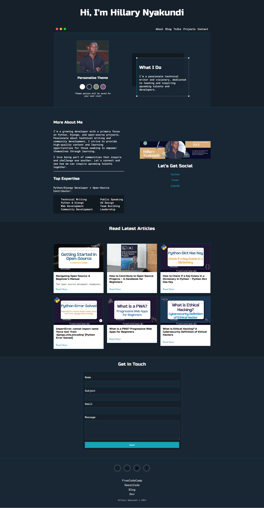

# PersonalPortifolio

This personal portfolio project showcases my skills in HTML, CSS, &amp; JavaScript. It's a single-page website that features a link to my blog page

## Key Features

- **Four Themes** - The portfolio offers four customizable themes to match diverse preferences and needs.
- **Live Page** - Explore the live version of the portfolio [HERE](https://larymak.netlify.app/).

## Technologies Used

- **HTML** - Structuring the content.
- **CSS** - Styling and designing the site.
- **JavaScript** - Adding interactivity to the site.

## How to Use

- Click the provided link above to explore the live portfolio.
- Experiment with different themes by selecting your preferred option.
- Navigate through the single-page layout and explore my work easily.

## Future Improvements

- Enhance responsiveness for various screen sizes.
- Add more projects to the portfolio.
- Improve accessibility and overall user experience.
